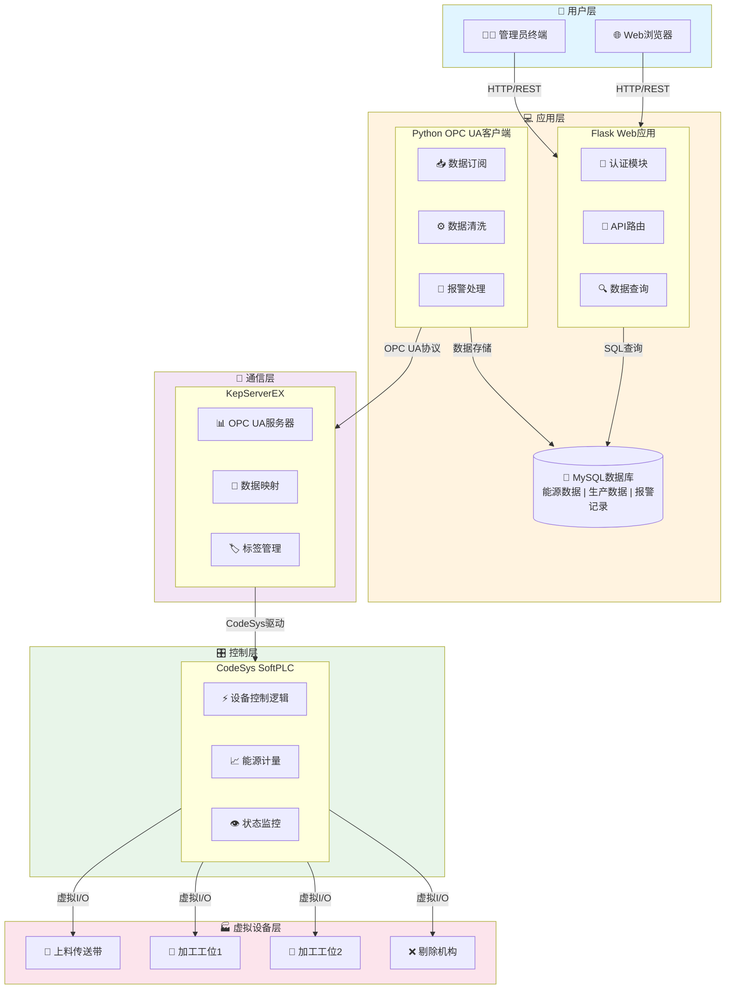
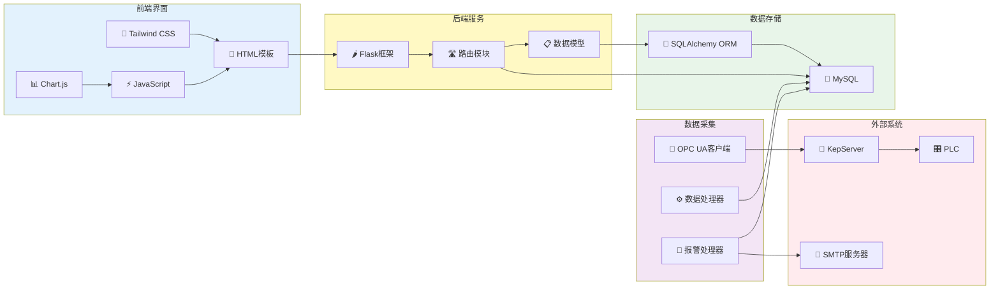
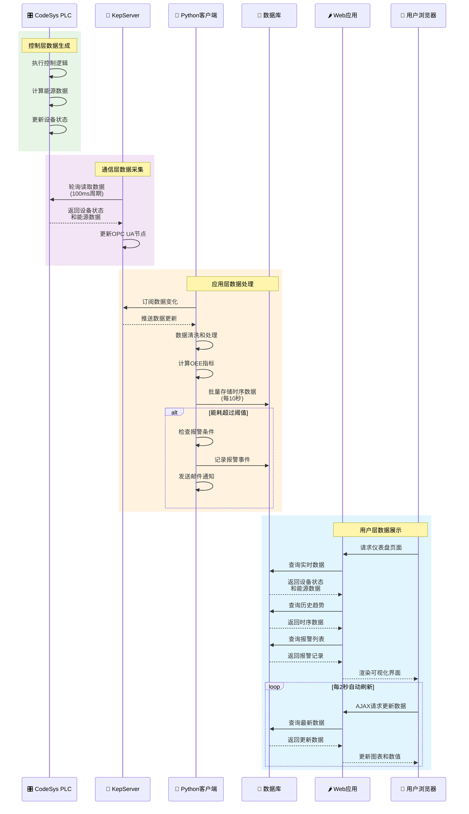
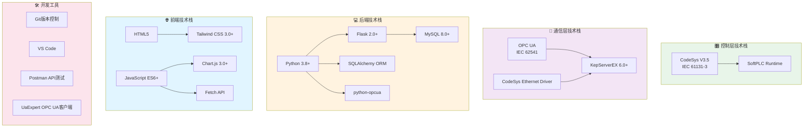

# 能源管理系统 (Energy Management System)

基于PLC和OPC UA的自动化生产线能源管理系统。通过KepServer实现多设备集成与数据采集，模拟工业场景中的设备状态监控、能源消耗分析及预警功能。

## 系统概述

本系统采用三层工业自动化架构，实现从设备控制到数据可视化的完整能源管理解决方案：

- **控制层**: CodeSys SoftPLC模拟生产线控制，实现设备自动化和能源计量
- **通信层**: KepServer作为OPC UA服务器，实现标准化工业通信
- **应用层**: Python客户端负责数据采集和处理，Flask Web应用提供用户界面和数据可视化

## 系统架构

### 整体架构图

系统采用分层架构设计，从底层设备控制到上层数据可视化，实现完整的工业自动化解决方案。



### 组件关系图

展示各组件之间的依赖和交互关系。



### 数据流向图

展示数据从PLC采集到Web界面展示的完整流程。



### 技术栈架构图

展示系统使用的技术栈和工具链。



## 项目结构

```
energy-management-system/
├── plc_program/              # PLC控制程序（CodeSys）
│   ├── FB_ConveyorControl.st      # 传送带控制功能块
│   ├── FB_StationControl.st       # 工位控制功能块
│   ├── FB_QualityCheck.st         # 质量检测功能块
│   ├── FB_EnergyMeter.st          # 能源计量功能块
│   ├── PLC_PRG.st                 # 主程序
│   ├── GVL_Config.st              # 全局变量配置
│   └── README.md                  # PLC程序说明文档
│
├── python_client/            # Python数据采集客户端
│   ├── main.py                    # 主程序入口
│   ├── opcua_client.py            # OPC UA客户端
│   ├── data_processor.py          # 数据处理模块
│   ├── database.py                # 数据库操作
│   ├── alarm_handler.py           # 报警处理
│   ├── models.py                  # 数据模型
│   ├── config.py                  # 配置管理
│   ├── init_database.py           # 数据库初始化脚本
│   ├── requirements.txt           # Python依赖
│   └── README.md                  # 客户端说明文档
│
├── web_app/                  # Flask Web应用
│   ├── app.py                     # Flask应用入口
│   ├── config.py                  # 应用配置
│   ├── routes/                    # 路由模块
│   │   ├── __init__.py
│   │   ├── auth.py                # 认证路由
│   │   ├── dashboard.py           # 仪表盘路由
│   │   └── api.py                 # API路由
│   ├── templates/                 # HTML模板
│   │   ├── base.html              # 基础模板
│   │   ├── login.html             # 登录页面
│   │   ├── dashboard.html         # 仪表盘页面
│   │   └── history.html           # 历史数据页面
│   ├── static/                    # 静态资源
│   │   ├── css/
│   │   │   └── styles.css
│   │   └── js/
│   │       ├── dashboard.js       # 仪表盘逻辑
│   │       └── charts.js          # 图表渲染
│   ├── requirements.txt           # Python依赖
│   └── README.md                  # Web应用说明文档
│
├── logs/                     # 日志目录
│   └── .gitkeep
│
├── .env.example              # 环境变量配置模板
├── .env                      # 环境变量配置（不提交到Git）
├── .gitignore                # Git忽略文件
├── start_system.bat          # 系统启动脚本
├── stop_system.bat           # 系统停止脚本
└── README.md                 # 项目说明文档
```

## 快速开始

### 方法一：使用启动脚本（推荐）

1. **配置环境变量**
   ```bash
   copy .env.example .env
   ```
   编辑 `.env` 文件，配置数据库连接和OPC UA服务器地址

2. **初始化数据库**
   ```bash
   python python_client\init_database.py
   ```

3. **启动系统**
   ```bash
   start_system.bat
   ```
   脚本会自动：
   - 检查Python环境和依赖
   - 创建虚拟环境（如果不存在）
   - 安装所需依赖
   - 启动Python数据采集客户端
   - 启动Flask Web应用

4. **访问系统**
   - Web界面: http://localhost:5000
   - 默认账户: admin / admin123

5. **停止系统**
   ```bash
   stop_system.bat
   ```

### 方法二：手动安装和启动

#### 1. 环境准备

**系统要求：**
- Windows 10/11
- Python 3.8+
- MySQL 8.0+ 或 SQLite
- CodeSys V3.5+ (用于PLC编程)
- KepServerEX 6.0+ (用于OPC UA通信)

#### 2. 创建虚拟环境

```bash
python -m venv .venv
.venv\Scripts\activate
```

#### 3. 安装Python依赖

```bash
# 安装Python客户端依赖
pip install -r python_client\requirements.txt

# 安装Web应用依赖
pip install -r web_app\requirements.txt
```

#### 4. 配置环境变量

复制 `.env.example` 为 `.env` 并修改配置：

```bash
copy .env.example .env
```

**关键配置项：**

```ini
# 数据库配置
DB_TYPE=mysql
DB_HOST=localhost
DB_PORT=3306
DB_USER=energy_user
DB_PASSWORD=your_password
DB_NAME=energy_management

# OPC UA服务器配置
OPC_UA_SERVER_URL=opc.tcp://localhost:4840

# Flask配置
SECRET_KEY=your-secret-key-change-this
FLASK_DEBUG=True
FLASK_PORT=5000
```

#### 5. 数据库初始化

**使用MySQL：**
```sql
CREATE DATABASE energy_management CHARACTER SET utf8mb4 COLLATE utf8mb4_unicode_ci;
CREATE USER 'energy_user'@'localhost' IDENTIFIED BY 'your_password';
GRANT ALL PRIVILEGES ON energy_management.* TO 'energy_user'@'localhost';
FLUSH PRIVILEGES;
```

**运行初始化脚本：**
```bash
python python_client\init_database.py
```

这将创建所有必要的表并插入初始数据（管理员账户等）。

#### 6. PLC程序部署

1. 使用CodeSys打开 `plc_program` 目录中的项目文件
2. 配置SoftPLC运行时（通常是127.0.0.1）
3. 编译并下载程序到PLC
4. 启动PLC运行模式

详细说明请参考 `plc_program/README.md`

#### 7. KepServer配置

**创建通道：**
- 通道名称: CodeSys_Channel
- 驱动类型: CodeSys Ethernet
- IP地址: 127.0.0.1
- 端口: 1217

**添加设备：**
- 设备名称: ProductionLine_PLC
- 通道: CodeSys_Channel

**配置标签：**
映射PLC变量到OPC UA节点（参考设计文档中的标签组织结构）

**启用OPC UA服务器：**
- 端口: 4840
- 安全策略: None（开发环境）
- 启用匿名访问

详细配置指南请参考 `docs/KEPSERVER_SETUP.md`（如果存在）

#### 8. 启动系统

**启动Python数据采集客户端：**
```bash
python python_client\main.py
```

**启动Flask Web应用（新终端）：**
```bash
python web_app\app.py
```

#### 9. 访问系统

打开浏览器访问: http://localhost:5000

**默认登录账户：**
- 用户名: admin
- 密码: admin123

## 功能特性

### 核心功能

- ✅ **PLC自动化控制**: 传送带、多工位加工、质量检测、剔除机构的自动化控制
- ✅ **实时能源监控**: 实时采集各设备功率和能耗数据，1秒更新周期
- ✅ **历史数据分析**: 支持时间范围查询，按小时/天/周统计分析
- ✅ **OEE计算**: 自动计算设备综合效率（可用率、性能率、质量率）
- ✅ **智能报警**: 能耗阈值监控，多级报警（警告/严重/紧急）
- ✅ **用户权限管理**: 基于角色的访问控制（管理员/普通用户）
- ✅ **数据可视化**: 实时仪表盘、趋势图表、报警列表

### 技术特点

- 🔌 **标准化通信**: 基于OPC UA工业标准协议
- 📊 **实时数据**: WebSocket推送，2秒内界面刷新
- 🔒 **安全可靠**: 用户认证、会话管理、SQL注入防护
- 📈 **性能优化**: 批量写入、数据缓存、连接池管理
- 🔄 **自动重连**: 网络断开自动重连，数据缓存不丢失
- 📝 **完整日志**: 操作日志、错误日志、报警日志

## 系统组件说明

### 1. PLC控制程序 (plc_program/)

**主要功能块：**
- `FB_ConveyorControl`: 传送带控制（启停、速度调节、功率计算）
- `FB_StationControl`: 工位控制（工艺流程、时序控制、能耗监测）
- `FB_QualityCheck`: 质量检测（合格判定、不良品标记）
- `FB_EnergyMeter`: 能源计量（功率累加、能耗统计、异常检测）
- `PLC_PRG`: 主程序（设备状态机、生产线控制）

**详细文档**: 参考 `plc_program/README.md`

### 2. Python数据采集客户端 (python_client/)

**核心模块：**
- `opcua_client.py`: OPC UA连接管理、节点订阅、数据读取
- `data_processor.py`: 数据清洗、异常检测、OEE计算
- `database.py`: 数据库操作、批量写入、历史查询
- `alarm_handler.py`: 报警检查、阈值比较、邮件通知
- `main.py`: 主程序入口、模块集成、优雅关闭

**运行方式：**
```bash
python python_client\main.py
```

**详细文档**: 参考 `python_client/README.md`

### 3. Flask Web应用 (web_app/)

**路由模块：**
- `routes/auth.py`: 用户认证（登录/登出、权限控制）
- `routes/dashboard.py`: 仪表盘页面路由
- `routes/api.py`: RESTful API端点

**API端点：**
- `GET /api/devices`: 获取设备列表
- `GET /api/devices/{id}/current`: 获取设备当前数据
- `GET /api/devices/{id}/history`: 获取设备历史数据
- `GET /api/energy/summary`: 获取能耗汇总
- `GET /api/oee`: 获取OEE数据
- `GET /api/alarms`: 获取报警列表
- `POST /api/alarms/{id}/acknowledge`: 确认报警
- `GET /api/thresholds`: 获取阈值配置
- `PUT /api/thresholds/{id}`: 更新阈值（管理员）

**运行方式：**
```bash
python web_app\app.py
```

**详细文档**: 参考 `web_app/README.md`

## 配置说明

### 环境变量配置 (.env)

系统通过 `.env` 文件进行配置，主要配置项包括：

**数据库配置：**
- `DB_TYPE`: 数据库类型（mysql/sqlite）
- `DB_HOST`, `DB_PORT`: 数据库服务器地址
- `DB_USER`, `DB_PASSWORD`: 数据库账户
- `DB_NAME`: 数据库名称

**OPC UA配置：**
- `OPC_UA_SERVER_URL`: KepServer地址（如 opc.tcp://localhost:4840）
- `OPC_UA_TIMEOUT`: 连接超时时间
- `OPC_UA_RECONNECT_ATTEMPTS`: 重连尝试次数

**Web应用配置：**
- `SECRET_KEY`: Flask密钥（生产环境必须修改）
- `FLASK_DEBUG`: 调试模式（生产环境设为False）
- `FLASK_PORT`: Web服务端口
- `SESSION_TIMEOUT`: 会话超时时间

**报警配置：**
- `EMAIL_ENABLED`: 是否启用邮件通知
- `SMTP_SERVER`, `SMTP_PORT`: SMTP服务器配置
- `ALERT_EMAIL_RECIPIENTS`: 报警接收邮箱

完整配置项请参考 `.env.example` 文件。

## 技术栈

### 控制层
- **PLC**: CodeSys V3.5 (IEC 61131-3标准)
- **运行时**: SoftPLC / 硬件PLC

### 通信层
- **协议**: OPC UA (IEC 62541标准)
- **服务器**: KepServerEX 6.0+
- **驱动**: CodeSys Ethernet Driver

### 应用层
- **语言**: Python 3.8+
- **Web框架**: Flask 2.0+
- **OPC UA库**: opcua-asyncio / python-opcua
- **数据库ORM**: SQLAlchemy
- **数据库**: MySQL 8.0+ / SQLite 3

### 前端
- **HTML5**: 语义化标签
- **CSS**: Tailwind CSS 3.0+
- **JavaScript**: ES6+
- **图表**: Chart.js 3.0+
- **HTTP客户端**: Fetch API

## 故障排查指南

### 问题1: Python客户端无法连接到OPC UA服务器

**症状**: 日志显示 "Connection failed" 或 "Timeout"

**解决方法**:
1. 检查KepServer是否运行: 打开KepServer管理界面
2. 检查OPC UA服务器是否启用: KepServer → OPC UA Configuration
3. 检查防火墙: 确保4840端口未被阻止
4. 检查 `.env` 中的 `OPC_UA_SERVER_URL` 配置是否正确
5. 使用UaExpert工具测试连接: 连接到 opc.tcp://localhost:4840

### 问题2: 数据库连接失败

**症状**: 日志显示 "Database connection error"

**解决方法**:
1. 检查MySQL服务是否运行: `net start MySQL80`
2. 检查数据库是否存在: `SHOW DATABASES;`
3. 检查用户权限: `SHOW GRANTS FOR 'energy_user'@'localhost';`
4. 检查 `.env` 中的数据库配置
5. 测试连接: `mysql -u energy_user -p -h localhost energy_management`

### 问题3: Web界面无法访问

**症状**: 浏览器显示 "无法访问此网站"

**解决方法**:
1. 检查Flask应用是否运行: 查看终端输出
2. 检查端口占用: `netstat -ano | findstr :5000`
3. 检查防火墙设置
4. 尝试使用 http://127.0.0.1:5000 访问
5. 查看日志文件: `logs/web_app.log`

### 问题4: PLC数据未更新

**症状**: Web界面显示数据不变化

**解决方法**:
1. 检查PLC是否运行: CodeSys → Online → Login
2. 检查KepServer是否读取到数据: KepServer → Quick Client
3. 检查Python客户端是否订阅成功: 查看日志
4. 检查数据采集周期配置: `.env` 中的 `DATA_COLLECTION_INTERVAL`
5. 重启整个系统: `stop_system.bat` 然后 `start_system.bat`

### 问题5: 报警未触发

**症状**: 能耗超过阈值但未显示报警

**解决方法**:
1. 检查阈值配置: 访问 `/api/thresholds` 查看当前阈值
2. 检查报警处理模块是否运行: 查看Python客户端日志
3. 检查报警去重逻辑: 5分钟内相同报警只记录一次
4. 检查连续异常判定: 默认需要连续3次超阈值才报警
5. 查看数据库报警表: `SELECT * FROM alarms ORDER BY timestamp DESC;`

### 问题6: 依赖安装失败

**症状**: pip install 报错

**解决方法**:
1. 升级pip: `python -m pip install --upgrade pip`
2. 使用国内镜像: `pip install -r requirements.txt -i https://pypi.tuna.tsinghua.edu.cn/simple`
3. 检查Python版本: `python --version` (需要3.8+)
4. 使用虚拟环境: 避免依赖冲突
5. 逐个安装依赖: 找出具体哪个包有问题

### 问题7: 启动脚本执行失败

**症状**: start_system.bat 报错

**解决方法**:
1. 以管理员身份运行
2. 检查 `.env` 文件是否存在
3. 检查虚拟环境是否正确创建
4. 手动执行脚本中的命令，定位问题
5. 查看日志文件: `logs/python_client.log` 和 `logs/web_app.log`

### 获取帮助

如果以上方法无法解决问题，请：
1. 查看详细日志文件
2. 检查系统事件查看器
3. 参考各组件的详细文档（README.md）
4. 联系项目维护者

## 开发指南

### 代码规范

- Python代码遵循 PEP 8 规范
- 使用类型提示（Type Hints）
- 编写文档字符串（Docstrings）
- 单元测试覆盖核心功能

### 添加新设备

1. 在PLC程序中添加设备控制逻辑
2. 在KepServer中映射新设备的标签
3. 更新 `config.py` 中的 `OPC_UA_NODES` 配置
4. 在数据库中添加设备阈值配置
5. 更新Web界面显示新设备数据

### 自定义报警规则

1. 在数据库 `thresholds` 表中添加新阈值
2. 修改 `alarm_handler.py` 中的检查逻辑
3. 更新报警级别判定规则
4. 配置邮件通知模板

### 扩展API端点

1. 在 `web_app/routes/api.py` 中添加新路由
2. 实现数据查询逻辑
3. 添加权限控制装饰器
4. 更新API文档

## 性能优化建议

### 数据库优化
- 定期清理历史数据（超过30天）
- 为时间戳和设备ID字段添加索引
- 使用分区表存储大量历史数据
- 启用查询缓存

### 应用优化
- 启用Redis缓存热点数据
- 使用批量写入减少数据库操作
- 优化OPC UA订阅，减少不必要的数据更新
- 使用CDN加速静态资源加载

### 网络优化
- 使用WebSocket替代轮询
- 启用Gzip压缩
- 配置Nginx反向代理
- 使用负载均衡（生产环境）

## 安全建议

### 生产环境部署

1. **修改默认密码**: 更改管理员账户密码
2. **启用HTTPS**: 配置SSL证书
3. **启用OPC UA安全**: 使用加密和证书认证
4. **配置防火墙**: 限制端口访问
5. **定期备份**: 数据库和配置文件
6. **更新密钥**: 修改 `.env` 中的 `SECRET_KEY`
7. **禁用调试模式**: 设置 `FLASK_DEBUG=False`
8. **限制访问**: 配置IP白名单

### 数据安全

- 密码使用bcrypt加密存储
- 使用参数化查询防止SQL注入
- 输入验证和输出转义防止XSS
- 会话令牌安全管理
- 操作日志审计

## 系统维护

### 日常维护

- 监控日志文件大小（自动轮转）
- 检查数据库连接池状态
- 监控系统资源使用（CPU、内存、磁盘）
- 定期备份数据库
- 检查报警邮件发送状态

### 数据备份

**备份数据库：**
```bash
mysqldump -u energy_user -p energy_management > backup_$(date +%Y%m%d).sql
```

**恢复数据库：**
```bash
mysql -u energy_user -p energy_management < backup_20251201.sql
```

### 日志管理

日志文件位置：
- Python客户端: `logs/python_client.log`
- Web应用: `logs/web_app.log`

日志自动轮转配置（10MB，保留5个备份）

## 版本历史

### v1.0.0 (2025-12-01)
- ✅ 完成PLC控制程序开发
- ✅ 实现OPC UA数据采集
- ✅ 完成数据库设计和实现
- ✅ 实现Web可视化界面
- ✅ 实现报警和通知功能
- ✅ 完成系统集成和测试

## 许可证

本项目仅供学习和研究使用。

## 贡献指南

欢迎提交问题报告和改进建议。

## 联系方式

如有问题，请联系项目维护者。

## 致谢

感谢所有开源项目和社区的支持。
